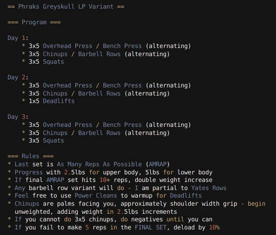

# DougFitness (in progress....)

A MERN stack fitness app based on Phraks Greyskull LP Variant workout program.

## Table of Contents

- [Description](#description)
- [Technology](#Technology)
- [Installation](#installation)
- [Usage](#usage)

## Description:

This application is a workout tracker for a modified version of the Phraks Greyskull LP Variant program.

### PROGRAM

## Technology:

Technologies utilized:

- Mongoose
- Express.js
- React.js
- Node.js
- Crypto
- JWT Authentication

## Installation

To run locally, input in terminal:

npm install

## Usage

- Choose between Workout A or B
- Click weight to edit workout
- Click '5' button to complete set (click again to lower reps)
- Login to access user profile and save workout weights
